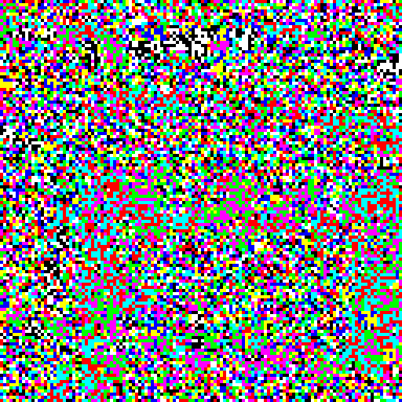
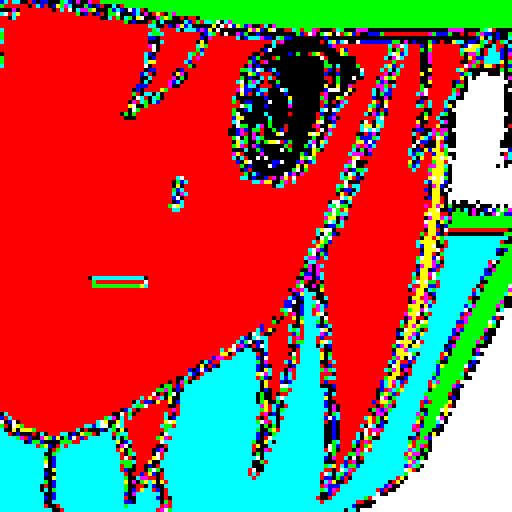
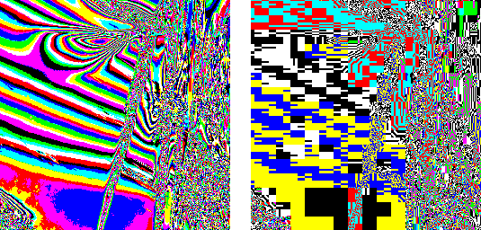
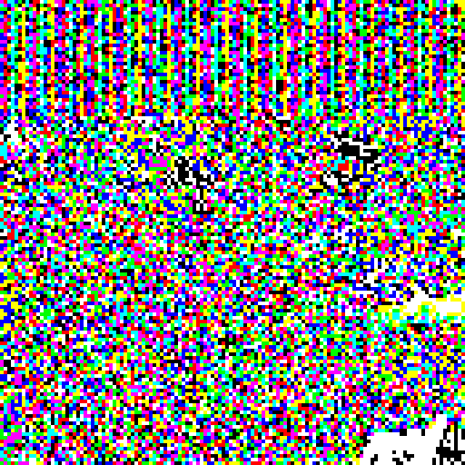
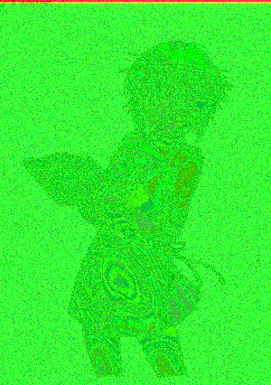

# Least significant bit. Or even less.

I decided to write this article while doing some research for fun and education. I just want to show how that steganography magik is done. And also to show a bit more things than just *do the LSB flip*.

So, for who I write? For curious persons just like me. You can google a lot of information on this topic, but it either will be written in some mathspeek or be outdated or inadequate. Sometimes it takes too much time to find out what described idea or algorithm is quite simple. So i will try to share my knowledge in a simple words.

## Flying over the least significant nest

Why [Least Significant Bit][2]? Everyone who knows enough about steganography will tell you what LSB is the worst method of data embedding. *"It's so bad at hiding"* because it is most simple thing what you can do. And as we talking about basics then this is what we need.

While doing my research i wrote a bit of code. And that code evolved to a small lib what can do several tricks with LSB. You can find it here: <https://github.com/desudesutalk/lsbtools>

Most usable part of it is online version of that tools: <http://desudesutalk.github.io/lsbtools/>

First lets take a look at that so called "LSB plane". I downloaded some random picture from the internet, then processed it in a way what changes color value to 255 if its LSB is set and makes color equals to 0 if LSB is not set.

In my case output was like this (here is apart of image upscaled 4 times):



Looks quite random! But if you look closely you will see what there is something in that mess what looks like part of original image squeezing through.

And what if we test it on some image of a woman from japanese animation film?



I'm quite sure what someone will be able to tell her name.

Another interest was what will JPEG compression do to LSB plane of an image.



Here on left is LSB of original png image and on right LSB of it after converting to JPEG (with quality 75). Quite fun, isn't it? Where is my speccy?

Now lets put something in that field.

## Flipping false to truth

How we will embed data into LSB? Lets think about LSBs of image pixels as a continuous stream of bits what we can read and write to at any desired bit position.

Then we can treat our data also as a stream of bits and write it sequentially to the bitstream of image LSBs. So we will change LSBs of pixels to match bits of our data. What is interesting here is what half the time LSB will match our data and we will change nothing. In other words you need to change only one LSB per two bits of your data.

Yep, this is fun, but lets check LSB plane of image with data embedded into it.



It's clearly visible what we have something here. You ca think what we need to encrypt our data to make it look like random noise. From one point this is absolutely correct - you need to encrypt data you hide in images. But this in most cases will not make your data less "visible". This is where our problems start.

### Chio-chan in a box
Chi-square attack makes our life harder because its idea is to find places int the image LSB plane where bits are different from all other places. Statistically. Be it random or be it plain text embedded as is, this beast will find it.

How? Method was proposed by Andreas Westfeld and Andreas Pfitzmann in the "Attacks on Steganographic Systems. Breaking the Steganographic Utilities EzStego, Jsteg, Steganos, and S-Tools and Some Lessons Learned" paper.

Thanks to Web archive we still can read that publication:
<https://web.archive.org/web/20151123010933/http://users.ece.cmu.edu/~adrian/487-s06/westfeld-pfitzmann-ihw99.pdf>

Chi-squared test is used to proof what something is looks like we expect it to look. In our case we check what colors what differs only in LSB are presented in image in same amounts. Why? Because this is what our embedded data will change in image statistics.

For example we have two color values (in binary): 0011010**0** and 0011010**1**. This is called Pair of Values. If LSB contains random (encrypted, or "masked") data, then chances to find any of this two colors will be equal. And if our data is not random, chances will follow statistics of our data. And in both cases this will be different from statistics of image.

We start to count how many times each color appears in the image. After counting (for example) 1% of image colors we will perform our test. For example we get this values for two colors:
```none
00110100   appears 100 times
00110101   appears 200 times
```

In our theory we expect what values from this pair appears with equal frequencies. So our theoretical value will be average of this two. `(100 + 200) / 2 = 150`. And for observed value we will take one of the counted frequencies.

And we will have set of 128 expected values and 128 observed (because we operate on bytes and only change in LSB is interested to us). On this dataset we will perform chi-squared test. If this test confirms what observation meets expectation then that means what we have random data embedded here.

We continue this process until all image is counted and checked (so we will get test results for 1% of all pixels, then for 2%, then for 3% and so on). And if data was embedded into image then from the start our test will be positive and after end of embedded data (if we used only part of image capacity) test quite quickly start to fail.


On this image red region covers part where chi-squared passed. And the green region where failed. And here is image of random data embedded in image with quite noisy LSB plane.


For the eye it looks like same random pixels, but chi-square get it without problems. So how we can hide our data from this test?

## Everyday I'm Shuffling

Idea is to spread our data across image evenly. So there will be no one single block with our bits what will look as something what shouldn't be there.

Now we embed our bits sequentially starting from first pixel and going from left to right and from top to bottom. In other words our order of embedding positions looks like this: `[0, 1, 2, 3, 4, 5, 6 ... 100500]`.

What we going to do, is shuffle that order and embed our data in positions like this `[7562, 12, 94772, 11397, 56942, 30948, 5006 ... 22103]`



Here we have same data embedded with bits positions shuffled. And chi-square test fails to detect that. But actually this also does not help much because there is a lot of attacks on hidden in LSB plane data. For example this one:
<http://www.ws.binghamton.edu/fridrich/Research/acm_2001_03.pdf>

While it was very easy to implement this attack just by reading carefully that pdf file, i still not get what math magik is hidden within it. But it works quite well. Sometimes showing size of embedded message very accurately.

One small problem with that method is what it "detects" messages even in clean images. My implementation often shows something near 2kb of embedded data for clean images. In the paper it is stated

> *An upper bound of 0.005 bits/pixel was experimentally determined for safe LSB embedding.*

For 800x600 image it means 300 bytes. Maybe this is true for carefully trained and tuned implementation of that algorithm. In this case situation is not so good. But maybe it will be enough to have just 300 bytes for your message? You have only 140 chars on twitter!

## Follow the humming rabbit

1920x1080 = 2073600 pixels. And if we multiply this by 0.005 we get 10368 bits of data. And now remember what we change one LSB per two bits of data. That means what we can change only 5184 LSBs in our FulHD image. More than that and we will be detected. Can we embed more data but change only 5184 LSBs?

Here comes into play ol'n'good coding theory. A lot of nice things was invented since we started to send codes over the wire. And now we will use so called Binary Hamming Code. If you can stand it - read wikipedia article about them.

Interesting property of this codes is what they can detect and correct one bit error. What is more interesting, this codes tell us number of the failed bit.

So here is how this codes constructed.

|Parity bits|Total bits|
|:---------:|:--------:|
|2          | 3        |
|3          | 7        |
|4          | 15       |
|5          | 31       |
|...        | ...      |
|m          | 2^m - 1  |

We have code words of lengths `2^m - 1`. And in that code word `m` bits are used for parity check. When you check correctness of this codes you will get 0 if code word is correct. Otherwise you will get value consisting of `m` bits what are equals to position of failed bit (counting from 1). Lets invert that idea. In steganography books and articles this is called "matrix encoding".

For example: we have 15 random bits. Let them be `000100111010101`. Lets treat them as a hamming code and count their parity check bits. This is done by XOR'ing up position numbers of bits what equals to `1`. We number our bits from left to right starting from one. In our example the "set" bits are at positions 4, 7, 8, 9, 11, 13 and 15.

Our parity bits will be: 4 XOR 7 XOR 8 XOR 9 XOR 11 XOR 13 XOR 15 = 11 or `1011` in binary. If that bits was really a hamming code, then that code has error at bit number 11.

Here all this as a "matrix"

|            | Position | 1 | 2 | 3 | 4 | 5 | 6 | 7 | 8 | 9 | 10| 11| 12| 13| 14| 15|
|:----------:|:--------:|:-:|:-:|:-:|:-:|:-:|:-:|:-:|:-:|:-:|:-:|:-:|:-:|:-:|:-:|:-:|
|Check result|Code bits | 0 | 0 | 0 | 1 | 0 | 0 | 1 | 1 | 1 | 0 | 1 | 0 | 1 | 0 | 1 |
|      1     |          | X |   | X |   | X |   | X |   | X |   | X |   | X |   | X |
|      1     |          |   | X | X |   |   | X | X |   |   | X | X |   |   | X | X |
|      0     |          |   |   |   | X | X | X | X |   |   |   |   | X | X | X | X |
|      1     |          |   |   |   |   |   |   |   | X | X | X | X | X | X | X | X |

Now lets change this code in such a way so its parity bits well tell us what failure was at position 5 (`0101` in binary). This is data bits we want to embed.

Because XOR operation is very funny we just need to do 11 XOR 5. This equals to 14. And if we now flip bit at position 14 our parity check will yield 5. Lets check that.

Now our code is `000100111010111`. "Set" bits are 4, 7, 8, 9, 11, 13, 14 and 15. XOR em up: 4 XOR 7 XOR 8 XOR 9 XOR 11 XOR 13 XOR 14 XOR 15 = 5

Bingo! We just embedded 4 bits by changing only one!

Now lets go back to our capacity problem. In our FullHD image we can change 5184 bits. In other words this is number of hamming codes we can have in our LSB plane. Totally we have 1920x1080x3 = 6220800 bits. Thus we can have up to 1200 bits in our codes. Nearest usable value of `m` is 10. Because 2^10-1 = 1023 and 2^11-1 = 2047.

10 bits instead of 2! 51840 bits (or 6480 bytes) of data can be embedded.

## A small change for byte but a big leap for a mankind

Actually there is another way to trick all that tests. Instead of flipping LSB we can randomly do `+1` and `-1`. There are two edge cases: we can't decrease 0 (so we always increase it) and we can't increase 255 (so we always decrease it). For all other cases we just randomly (yes, absolutely randomly) increase or decrease value of whole color component LSB of which we want to change. This is called **±1 encoding**.

For LSB this gives same effect as bit flip and you will be using same extraction logic to get your data back. If you take a look on LSB plane of image where this encoding was used, there will be no difference with simple bit flipping.

Flipping one bit is just one bit. But in case of ±1 encoding the whole component now also changes. And changes randomly. And in some extreme cases this is very huge change. For example, if we want to flip LSB of 127 (`01111111` in binary) and randomly decided to increase that byte, the resulting value will be 128 (`10000000` in binary). We changed all bits in a byte!

So what's the deal?

LSB steganography in lossless images are old enough and thus very well studied. This method is very simple and actually quite destructive. So there exists many accurate attacks and you just can't simply embed one kilobyte of data into FullHD wallpaper and be safe.

But the problem here is what many of this attacks (if not all) use correlations between LSB and all other bits of color components. Remember how often LSB plane reveals actual image? That's it.

I've tried that fancy method of finding size of the embedded message and it fails on ±1 encoding. Even if I use ALL available space it still shows numbers just like image is clean. Chi-squared test also fails. Clean image shows 1.5% usage. And fully embedded 1.75%.

Unfortunately I don't have much reliable info about detection of ±1 encoding. For example, this work <http://www.cipr.rpi.edu/~pearlman/papers/harmsEI03.pdf> describes method of very good detection of stegoimages with data occupying all available space. There seems exists some research on this coding and also looks like detection of 25% payload is also possible.

At this point I think what if we use very good cover images and will not embed too much then with tricks (shuffle, matrix coding, ±1) per pixel LSB steganography can actually work.

## Where to go now?

One of most obvious possibilities is switching from pixel to frequencies: go JPEG. For start you can watch this talk <https://youtu.be/BQPkRlbVFEs> Be ready to also meet same LSBs, shuffle, matrix coding and ±1 but in completely different domain.

There also exists more sophisticated ways to decide where to put your changed bit. For example you can drop monotonous zones of image and use only noisy ones. How this can be done?

If you understand mathspeak and wants more theory then it will be a good idea to find a copy of "Steganography in digital media. Principles, algorithms, and applications", a book by Jessica Fridrich. It's quite hard for me to read that math, but it really looks like a comprehensive source of information. Something like "Applied cryptography" by Bruce Schneier.

By the way, Jessica Fridrich is widely known in narrow circles of Rubic's Cube speedsolving adepts. And also she is very good at steganography. Check out her list of publications <http://www.ws.binghamton.edu/fridrich/publications.html>

Also images are not the only media what can be used to hide data. We have music, movies and plain text. What do you think, how LSB will perform in 24bit FLAC files?

Another interesting direction is coding theory. There is a lot of codes besides hamming. For example: there exists codes which can overlap. If it is in your interest, start from googling some free online lectures.

And finally good fellow of steganography - cryptography. As you can see they both play along very well. As idea take a look at <https://en.wikipedia.org/wiki/Visual_cryptography> - maybe this can be used with steganography? Split payload between two images and send them by unrelated channels?

### Thats all, folks!

I hope you enjoyed this walk in pixels shadows.

Good luck.

  [1]: https://github.com/desudesutalk/desudesutalk
  [2]: https://en.wikipedia.org/wiki/Least_significant_bit
