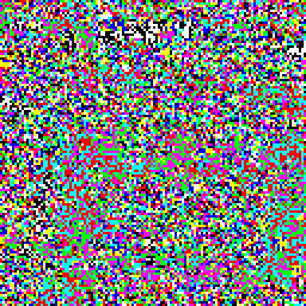
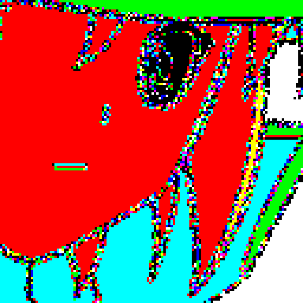
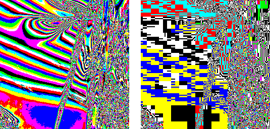
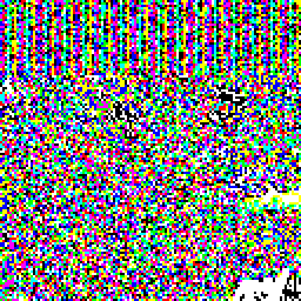
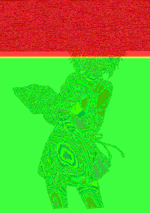
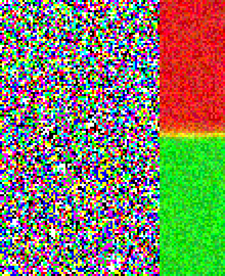

# Наименьший значащий бит. Или даже меньше.

Написать эту статейку я решил пока для самообразования разбирался с этой самой LSB стеганографией. Чтобы собрать все интересные факты в одном месте и заодно показать чуть больше чем просто *"давайте сбросим LSB"*.

Для кого я пишу это всё? Для тех кто так же как и я страдает любопытством и хотел бы узнать чуть больше чем написано в википедии. Можно нагуглить довольно много информации об этом всём, но чаще всего вы либо найдете статью полную матана, либо что-то старое или неадекватное (а ещё догадайся что это неадекват). Частенько выходит так, что приходится продраться через кучу информации прежде чем поймёшь насколько всё просто. Так что я попытаюсь кратко и доступно рассказать про самое интересное, что смог узнать.

## Пролетая над наименьшим значащим гнездом

Почему [LSB][2]? Любой, кто хоть что-то знает про стеганографию, сразу скажет что это самый худший метод из всех что есть. "Он настолько плох" потому что это самое простое, что можно сделать. А мне хотелось разобраться в стеганографии в принципе, так что это самое подходящее для начала.

Пока я возился с этой темой я написал немного кода, который в конце концов превратился в небольшую библиотеку: <https://github.com/desudesutalk/lsbtools>

Хотя самое интересное это возможность в пару кликов попробовать всё прямо в браузере: <http://desudesutalk.github.io/lsbtools/>

Для начала просто посмотрим на эту самую "плоскость LSB". Для этого возьмём картинку и для каждого пикселя изменим цвета (R, G, B компоненты) так, чтобы они были равны 255 если LSB равен единице. Если LSB ноль, то и компонент будет ноль.

Из фотографии получается что-то типа этого (тут у нас кусочек картинки увеличенный в четыре раза):



Ого, выглядит как рандом! Хотя, если присмотреться, можно заметить что там всё же что-то "проглядывает" от изначальной картинки.

А если взять картинку с нарисованной женщиной из японского анимационного фильма?



(Уверен, кто-то даже смог её сразу узнать)

Ещё интересно посмотреть что JPEG делает с LSB.



Слева у нас результат для оригинала. А справа после сжатия с качеством 75. Весьма забавно. *Где мой спекки?!*

Так, вроде бы более-менее понятно. Давайте теперь засунем в эти биты что-нибудь своё.

## Переворачивая правду в ложь

Итак, как будем записывать данные? Очень просто. Представим что все вот эти LSB это поток битов в который мы можем записывать свои биты и потом оттуда их читать. Берём наши данные, представляем их в виде битов и начинаем по одному запихивать в картинку, меняя соответствующий LSB так, чтобы он совпадал с битом наших данных.

Тут надо отметить, что довольно часто (в идеале с вероятностью 0.5) бит наших данных будет совпадать с наименьшим битом в картинке. Так что ничего менять не придётся. Таким образом мы меняем всего один бит картинки, а записываем целых два бита данных. Такая вот удача. Запомните этот факт.

И как же это выглядит в итоге?



Мда, даже на глаз видно что у нас в начале изображения есть что-то "лишнее". Первая же мысль - давайте зашифруем наши данные чтоб они походили на шум в картинке! В принципе это очень правильная мысль, данные надо шифровать перед стеганографией. Да вот только это не сильно поможет (а даже наоборот).

### Чи-тян

Статистика, бессердечная ты сука. Вся стеганография именно статистикой и ломается. Мы что-то меняем в картинке и тем самым нарушаем её статистические свойства. Есть, к примеру, такая магия статистики как [Хи-квадрат][3]. Вообще мне даже таблица умножения плохо даётся, так что более-менее понять что происходит мне помогли только [видео на ютубе][4] (интересно, почему на русском таких нет?)

В общем, мы пользуемся этой магией чтобы проверить совпадают ли наблюдаемые данные с тем, что мы ожидаем. Товарищи Вестфилд и Пфитцманн воспользовались этим в своей атаке, описанной в "[Attacks on Steganographic Systems. Breaking the Steganographic Utilities EzStego, Jsteg, Steganos, and S-Tools and Some Lessons Learned][5]" (спасибо ВебАрхиву!)

Если кратко: у нас есть два значения цвета (в двоичном виде) 0011010**0** и 0011010**1**. Это называется "Pair of Values". Если мы запишем в LSB картинки какие-то "случайные" данные (например зашифрованные. Мы же не хотим чтоб наше сообщение легко прочитали?), то два этих значения будут встречаться примерно одинаковое количество раз. Однако в "чистой" картинке это скорей всего будет не так.

Допустим, мы посчитали сколько раз эти значения встречаются в картинке и получили

```none
00110100   встретилось 100 раз
00110101   встретилось 200 раз
```

По нашей теории о "случайных данных в LSB" эти значения должны встретиться одинаковое число раз. Так что ожидаемое значение для каждого из них будет `(100 + 200) / 2 = 150`. В качестве наблюдаемого значения возьмём количество любого из двух значений (тут без разницы какое). Пусть будет 200. Всего таких пар у нас будет 128.

Мы начинаем собирать эту статистику по значениям цветов в картинке начиная с первого пиксела. Пройдя, к примеру, 1% картинки мы выполняем этот самый тест хи-квадрат. Потом продолжаем собирать данные и делаем ещё один тест на 2%. Потом на 3% и так пока вся картинка не будет проверена.

Пока в нашей картинке присутствую "случайные" данные, тест будет позитивным. Как только они кончатся, тест довольно быстро начнёт возвращать отрицательный результат.



На этой картинке красным отмечена часть, в которой согласно тесту что-то спрятано. Зелёным отмечена чистая часть без случайных данных. Ну, тут и на глаз это всё видно. А если у картинки будет шумный LSB?



Вот так вот. На глаз никакой особой разницы. Однако тест показал всё довольно точно.

Что же делать?

## Everyday I'm Shuffling

Решение очень простое. Сейчас мы записываем наши данные по порядку. Индексы битов в картинке прямо так и идут `[0, 1, 2, 3, 4, 5, 6 ... 100500]`. Вместо этого, мы будем записывать биты в случайные цвета. Возьмём какой-нибудь генератор псевдослучайных чисел, настроим его на выдачу одного и того же потока случайности и с его использованием перемешаем индексы цветов в картинке. Будет что-то типа `[7562, 12, 94772, 11397, 56942, 30948, 5006 ... 22103]`.

А результат записи будет выглядеть вот так.


Те же самые данные записаны в случайные биты. На глаз, конечно, видно, что с картинкой "что-то не так", однако тест хи-квадрат уже не работает.

Но, конечно, всё не так радужно. Атак на LSB стеганографию есть масса. И на такой способ внедрения тоже есть: <http://www.ws.binghamton.edu/fridrich/Research/acm_2001_03.pdf>

Тут, честно сказать, я так толком и не смог понять на что они опираются математически, но реализовать этот "RS Steganalysis" было довольно просто тупо повторяя его описание на джаваскрипте. И метод этот действительно работает!

В документе утверждается:

> *An upper bound of 0.005 bits/pixel was experimentally determined for safe LSB embedding.*

Дело в том, что для любой картинки этот тест вернёт какое-то значение как будто небольшое сообщение в изображении всё же есть. 0.005 бит/пиксель для картинки 800x600 означает 300 байт секретного сообщения. Такой точности моя реализация не даёт, но, думаю, если её правильно подкрутить и использовать какие-то более точные методы (а не те, что приведены в документе для "простоты описания"), то вполне возможно будет детектировать и такие короткие сообщения.

Вообще, если подумать, в один твит входит всего 140 символов. Может этого и достаточно будет? Хотя, если подумать…

## Оператор?

1920x1080 = 2073600 пикселей. Если умножить это на 0.005 то получим 10368 бит данных. А теперь вспоминаем, что на каждые два бита данных мы в среднем модифицируем только один бит в картинке. Другими словами, если мы поменяем в этой FullHD картинке более 5184 бит, то нас поймают.

А может как-то можно записать больше бит данных в один изменённый бит картинки?

И тут нам на помощь приходит старая добрая теория кодирования. Очень много крутых штук было придумано с тех пор как люди начали передавать коды по проводам. И сейчас мы воспользуемся одной из них - [Кодом Хэмминга][6].

У этого кода есть одно очень интересное свойство: с его помощью можно обнаружить один ошибочный бит. Что самое интересное, при проверке таких кодов мы получаем номер бита в котором ошибка.

Повторю из викистатьи:

|Parity bits|Total bits|
|:---------:|:--------:|
|2          | 3        |
|3          | 7        |
|4          | 15       |
|5          | 31       |
|...        | ...      |
|m          | 2^m - 1  |

У нас имеются кодовые слова длиной `2^m - 1`. И в них есть `m` контрольных бит. При проверке кода мы получим либо 0 (код верен), либо позицию ошибочного бита в слове (позиции начинаются с 1). Давайте перевернём эту идею.

Например, у нас есть 15 бит (LSB из картинки). Пусть они будут `000100111010101`. Теперь представим, что это код Хэмминга и проверим его. Для этого мы берём номера битов равных единице и хитро [складываем их по модулю два][7] (или по-русски: XOR'им их друг с другом). В нашем случае единицы стоят на позициях 4, 7, 8, 9, 11, 13 и 15

Проверяем: 4 XOR 7 XOR 8 XOR 9 XOR 11 XOR 13 XOR 15 = 11 или `1011` в двоичной системе. Если бы эти биты и правда были бы кодом Хэмминга, то у них ошибка в одиннадцатом бите.

Вот вся эта штука в виде "матрицы" (считаем крестики в нужных строках и столбцах и берём эту сумму по модулю два).

|            | Position | 1 | 2 | 3 | 4 | 5 | 6 | 7 | 8 | 9 | 10| 11| 12| 13| 14| 15|
|:----------:|:--------:|:-:|:-:|:-:|:-:|:-:|:-:|:-:|:-:|:-:|:-:|:-:|:-:|:-:|:-:|:-:|
|Check result|Code bits | 0 | 0 | 0 | 1 | 0 | 0 | 1 | 1 | 1 | 0 | 1 | 0 | 1 | 0 | 1 |
|      1     |          | X |   | X |   | X |   | X |   | X |   | X |   | X |   | X |
|      1     |          |   | X | X |   |   | X | X |   |   | X | X |   |   | X | X |
|      0     |          |   |   |   | X | X | X | X |   |   |   |   | X | X | X | X |
|      1     |          |   |   |   |   |   |   |   | X | X | X | X | X | X | X | X |

Теперь давайте изменим эти биты так, чтобы проверка нам говорила, что ошибка в бите номер 5 (`0101` в двоичной). Эта пятёрка и есть данные, которые мы хотим записать.

Так как XOR это очень весёлый оператор, то нам достаточно посчитать 11 XOR 5. Мы получим 14. И если мы теперь изменим значение бита номер 14, то наша проверка начнёт возвращать нужную нам пятёрку. Ну-ка?

Теперь наш "код" равен `000100111010111`. Единички на позициях 4, 7, 8, 9, 11, 13, **14** и 15. XOR'им их: 4 XOR 7 XOR 8 XOR 9 XOR 11 XOR 13 XOR 14 XOR 15 = 5

Бинго! Мы только что записали 4 бита данных, изменив всего 1 бит! Если бы нам надо было записать `0000`, мы бы просто изменили бит номер 11. А если бы захотели записать 15 (`1111`), то нужно было бы изменить бить номер 4.

Если вы начнёте читать книги и статьи по стеганографии, то этот метод в них будут называть "матричным кодированием".

Теперь вернёмся к нашей FullHD картинке. В ней мы можем поменять максимум 5184 бита. Это значит, что столько кодов Хэмминга мы можем использовать. Какой они будут длины? Всего доступных нам битов в этой картинке (если она цветная) 1920x1080x3 = 6220800. Делим это на 5184 и получаем 1200 - ровно столько может быть бит в наших кодах. Так вот, ближайшее подходящее нам значение `m` это 10. Так как 2^10-1 равно 1023, а 2^11-1 уже 2047.

Целых десять бит данных на один изменённый бит картинки! 51840 бит можно записать! То есть 6480 байт. Без кодов Хэмминга влезло бы в пять раз меньше, всего 1296.

## Маленькое изменение для байта, но большой скачок для человечества.

На самом деле есть ещё один способ как можно бороться с этими детекторами стеганографии. Вместо того чтобы просто менять наименьший значащий бит в байте цвета, мы можем этот самый байт целиком увеличивать либо уменьшать на единицу. Есть только два исключения: мы не можем уменьшить ноль, так что мы всегда его увеличиваем, и мы не можем увеличить 255, так что это значение мы всегда уменьшаем. Для всех других значений байта мы совершенно случайно выбираем либо увеличение на единицу, либо уменьшение. Это называется **±1 кодирование**.

При этом непосредственно сам LSB меняется точно так же как и раньше. Так что данные записанные таким способом мы извлекаем тем же самым методом (никаких изменений). Если посмотреть на LSB плоскость картинки, то она не будет меняться из-за того что был выбран другой метод кодирования.

Меняя только бит, мы меняем только его и больше ничего не трогаем. А в случае ±1 кодирования мы меняем весь байт. В самом экстремальном случае это может означать "огромные изменения": если наш цвет имеет значение 127 (`01111111` в двоичной) и мы случайно решили увеличить его на единицу чтоб записать ноль в LSB то в результате мы получим 128 (`10000000`). Мы изменили **вообще все** биты какие только были!

Так в чём профит?

LSB стеганография существует довольно давно и очень хорошо изучена. Это очень простой метод и поэтому имеется масса атак на него. И атаки эти порой настолько точные, что вы даже в FullHD валпейпер не можете спокойно записать один килобайт данных - вас найдут.

Но есть одна проблема. Помните как делается атака хи-квадрат? У нас меняется только LSB а все остальные биты не тронуты. И мы можем собрать статистику и из неё узнать, случайные ли у нас биты в LSB или нет. Всё равно есть какая-то связь между наименьшим значащим битом и всеми остальными. Это даже видно порой, когда оставив лишь LSB всё ещё можно разобрать что на картинке.

Используя ±1 кодирование мы не вносим таких серьёзных искажений во всю эту "статистику" как с простым изменением одного бита.

Тест хи-квадрат перестаёт видеть данные внедрённые таким образом. Волшебный "RS Steganalysis" тоже перестаёт что-то замечать. Даже если в картинку напихано данных под завязку.

К сожалению я не нашёл особо внятных статей о том насколько такой метод недетектируем. Хотя есть вот такая вот работа: <http://www.cipr.rpi.edu/~pearlman/papers/harmsEI03.pdf>. В ней описывается способ детектирования данных внедрённых с помощью ±1 и использующих 1 бит в пикселе. Сравните это с 0.005 бит на пиксель для обычного LSB. Менее **двухсот килобайт** в FullHD картинке, и мы уже *как бы незаметны*.

Такая вот история, ребятки. Могу лишь добавить, что если быть аккуратным, выбирать хорошие картинки (с шумным LSB), не жадничать и записывать данных поменьше, да ещё и с хитростями (перемешивание, матрицы, ±1), то всё выглядит не так уж и плохо.

## Что дальше?

Ну, самый очевидный вариант это уйти от пикселей и заняться частотами. Стеганография в JPEG. Если у вас хорошо получается воспринимать английский на слух, посмотрите эту лекцию о стеге в джпегах: <https://youtu.be/BQPkRlbVFEs>. Будьте готовы к тому что кроме всего прочего вы встретите всё те же самые LSB, матрицы и ±1, только "область" уже будет другая.

Ещё можно подумать о том, как избегать однородных областей. Уж больно очевидно получается когда на абсолютно белом кусочке картинки стоят случайные точечки.

А если у вас всё хорошо с матаном, то найдите книгу "Steganography in digital media. Principles, algorithms, and applications" за авторством Джессики Фридрих. Мне такие книги даются плохо, но, судя по всему, конкретно эта является очень хорошим источником разнообразной информации по теме. Что-то типа "Прикладной криптографии" Шнаера.

К слову, Джессика Фридрих широко известна в узких кругах любителей собирать Кубик Рубика на скорость. Ну и ещё она чертовски хороша в стеганографии. Только оцените этот объём научных статей! <http://www.ws.binghamton.edu/fridrich/publications.html>

Кроме того, помимо картинок у нас же есть ещё и аудио, видео и даже обычный текст. Везде можно что-то спрятать. Вот интересно, сможет ли аудиофил сдетектировать LSB стеганографию в 24-х битном FLAC-е?

Теория кодирования опять же. Там очень много интересных штук и Код Хэмминга самый простой из того что есть. Так что и тут можно улучшить наши показатели. К примеру есть такие коды которые могут пересекаться друг с другом. Или можно пойти глубже и засунуть один тип кодов в другой тип кодов потому что вы просто любите читать коды.

И куда же без криптографии? Это же прямо сестра стеганографии. Очень уж они хорошо друг с другом сочетаются. Можно обратиться в эту область. Вот просто как идея: <https://en.wikipedia.org/wiki/Visual_cryptography> - может это можно как-то добавить к стеганографии? Сообщение для извлечения которого надо две картинки?

### That's all, folks!

Надеюсь вам понравилось.

Удачи!

  [1]: https://github.com/desudesutalk/desudesutalk
  [2]: https://en.wikipedia.org/wiki/Least_significant_bit
  [3]: https://ru.wikipedia.org/wiki/%D0%9A%D1%80%D0%B8%D1%82%D0%B5%D1%80%D0%B8%D0%B9_%D1%85%D0%B8-%D0%BA%D0%B2%D0%B0%D0%B4%D1%80%D0%B0%D1%82
  [4]: https://www.youtube.com/watch?v=1Ldl5Zfcm1Y
  [5]: https://web.archive.org/web/20151123010933/http://users.ece.cmu.edu/~adrian/487-s06/westfeld-pfitzmann-ihw99.pdf
  [6]: https://ru.wikipedia.org/wiki/%D0%9A%D0%BE%D0%B4_%D0%A5%D1%8D%D0%BC%D0%BC%D0%B8%D0%BD%D0%B3%D0%B0
  [7]: https://ru.wikipedia.org/wiki/%D0%A1%D0%BB%D0%BE%D0%B6%D0%B5%D0%BD%D0%B8%D0%B5_%D0%BF%D0%BE_%D0%BC%D0%BE%D0%B4%D1%83%D0%BB%D1%8E_2
